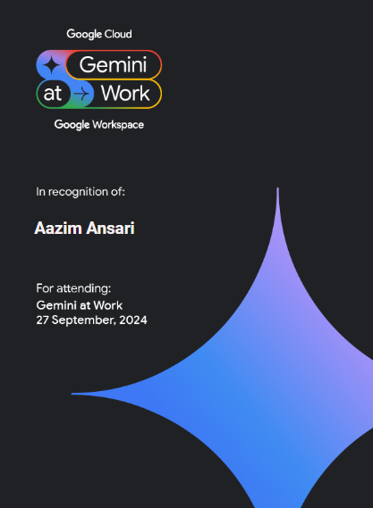

# Aazim Ansari
#### I am data engineering enthusiast

I am currently pursuing the Google Data Engineer Certification and have a strong passion for transforming data into actionable insights. My expertise includes building scalable data pipelines, managing large datasets through ETL processes, and leveraging cloud data services.

As a resourceful and inquisitive individual, I am highly motivated to create real-world business value. Integrity and honesty are my guiding principles, and I am seeking a remote position where I can apply my skills and knowledge to contribute to the company's success.

I am dedicated, hardworking, and quick to learn, with a proven ability to adapt to new technologies. I look forward to connecting with others in the data engineering community and fostering mutual growth!

Skills: Data pipelines, ETL, Cloud data, SQL, BigQuery

## Projects
Welcome to my portfolio of data engineering projects, where I showcase my expertise in leveraging Google Cloud to build robust data solutions. Throughout these projects, I’ve focused on ingesting data from diverse sources, designing efficient ETL/ELT processes, and developing seamless data pipelines. Utilizing tools like BigQuery and various cloud services, I’ve transformed raw data into actionable insights, demonstrating my ability to manage large datasets and optimize data workflows. [Join me](https://github.com/Aazimindxb/AzimAnsari/tree/main/GCP-Data-Engineering-Projects#google-cloud-data-engineering-projects) as I delve into the details of these projects, highlighting the challenges I faced and the innovative solutions I implemented.

## Certifications and Courses
  
 

 

 

 

 

 

 

> [!NOTE]
> Certification currently being pursued

 

## Contact

Please feel free to contact me if you have any questions at: 
